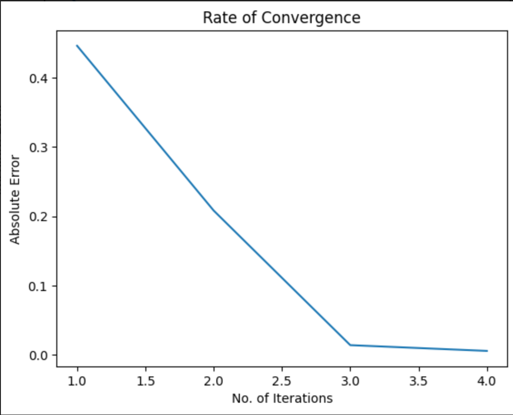

# CX/MATH 4640 Final Project
# Power-Method
```
---
Name: Aanya Khandelwal
Topic: 13 Power Method
Title: The Power Method: A comprehensive overview
----
```
## What is Power Method
Power Iteration or Power Method is an eigenvalue problem, that, when given a diagonalizabale matrix $A$, outputs the dominant eigenvalue of $A$. (Power iteration 2022)

Given eigenvalues $\lambda_1, \lambda_2, \lambda_3, \ldots \lambda_n$ of an $n\times n$ matrix $A$, $\lambda_1$ is said to be the dominant eigenvalue if it satisfies the following conditions:
$$|\lambda_1| > |\lambda_i| $$ for all $i = 1, 2, 3, \ldots n$ (10.3 Power Method for Approximating Eigenvalues - Universidad de Granada)

In order to perform power iteration on a matrix, the following conditions must be satisfied:
1. Matrix must be diagonalizable
2. Matrix must posses a single dominant eigenvalue
3. There must be a randomly chosen non-zero initial vector whose entries $\in R$

Power method is an iterative process that works on the following recurrence relation (given the aforementioned conditions): 
$$x_k = A\times x_{k-1} $$ 

(Heath, 2009)

## Proof of Power Method's convergence
It is known that the eigenvectors of a matrix form a basis using values $c_1, c_2, c_3, \ldots c_n$ that satisfy:
$$x = \sum_{i = 1}^k c_i v_i $$
This follows
$$x_0 = c_1 v_1 + c_2 v_2 + \ldots + c_n v_n$$
After one iteration of the basic power method (multiplication with $A$):
$$x_1 = A x_0 = c_1 v_1 \lambda_1 + c_2 v_2 \lambda_2 + \ldots + c_n v_n \lambda_n$$
$$\implies x_2 = A^2 x_0 = c_1 v_1 \lambda_1^2 + c_2 v_2 \lambda_2^2 + \ldots + c_n v_n \lambda_n^2$$
$$\implies x_k = A^k x_0 = c_1 v_1 \lambda_1^k + c_2 v_2 \lambda_2^k + \ldots + c_n v_n \lambda_n^k$$
$$\implies x_k = \lambda_1^k \bigg[c_1 v_1 + c_2 v_2 \bigg( \frac{\lambda_2}{\lambda_1}\bigg)^k + \ldots + c_n v_n \bigg( \frac{\lambda_n}{\lambda_1}\bigg)^k \bigg]$$
Given the initial assumption that $A$ must have a dominating eigenvector we know that $c_1 \neq 0$ and hence, the term $c_1 v_1$ dominates this equations when $k$ is very large.
According to the definition of dominating eigenvalue, we also know that $|\lambda_1|$ must be greater than $|\lambda_2|$ and so, $\big(\frac{\lambda_2}{\lambda_1}\big)^k$ becomes very small as $k$ becomes very large.

$$x_k \rightarrow c_1 v_1 \lambda_1^k \text{$\quad$as$\quad$    } k \rightarrow \infty$$

Therefore, the power method converges to calculates the dominating eigenvalue. 

(Wong), (Jones, 2020), (Silva)


Some observations:
1. The rate of convergence is linear
2. The rate depends on $\big |\frac{\lambda_2}{\lambda_1} \big|$

## Pseudocode
### Basic Power Iteration
```
def basic_PI(A):
  n, _ = shape(A)
  x_prev = random((n, 1))
  for i in range(threshold_value):
    x = A @ x_prev
    eig = x / x_prev
    x_prev = x
  return eig
```
(Heath, 2009)

### Normalized Power Iteration
The basic power method seen above involves many multiplications. With very small or very large values in the matrix $A$, it could quickly descend into an overflow or an underflow. To prevent this, a modified version of the power method normalizes the vector at each iteration. The value that converges to the eigenvalue is the norm. This is called Normalized Power Iteration.

```
def normalized_PI(A):
  n, _ = shape(A)
  x_prev = random((n, 1))
  for i in range(threshold_value):
    x = A @ x_prev
    norm_x = norm(x)
    x_prev = x / norm_x
  return norm
```
(Heath, 2009)

### Inverse Power Iteration
In the case that one requires the smallest magnitude eigenvalue instead of the largest, the fact that 
$$eigenvalue(A^{-1}) = 1 / eigenvalue(A) $$
Hence, in order to obtain the smallest magnitude eigenvalue, we perform inverse power iteration, which is power iteration with the inversed input matrix.

```
def inverse_PI(A):
  n, _ = shape(A)
  x_prev = random((n, 1))
  A_inv = inverse(A)
  for i in range(threshold_value):
    x = A_inv @ x_prev
    norm_x = norm(x)
    x_prev = x / norm_x
  return 1 / norm
```
(Heath, 2009)

**Note:** Instead of calculating the inverse (which is an expensive operation), one can find $x$ by solving the linear system $Ax = b$ using any more efficient method of choice.

### Shifted Power Iteration
Variations of power iteration to find the largest and smallest eigenvalues have been shown above. In the case that we need all eigenvalues of a matrix, we can employ the shifted power method. The idea is to shift the input matrix $A$ by its largest eigenvalue $\sigma$ and then perform regular power iteration. It performs on the following recurrence relation:
$$(A-\sigma I)x_{k+1} = x_k$$
This process of shifting and then performing the power method can be repeated many times to get all the eigenvalues of the matrix $A$.

(Kong et al., 2021)

## Cost and Rate of Convergence

The rate of convergence of the power method is linear and is proportional to  $\big |\frac{\lambda_2}{\lambda_1} \big|$. This can be observed with an 'Error vs. Iterations' graph:



The cost associated with the power method are as follows:
1. General/Normalized power method: $kn^2$
2. Inverse power method: $n^3 + kn^2$
(Silva)

## Applications
Though a slow-to-converge algorithm, the power method has many real-world use-cases and applications. It performs exceedingly well in eigenvalue problems with sparse matrices. Some of the notable applications of the power method are:
1. Calculating page rank in search engines (Google)
2. Showing follower recommendations to users (Twitter)
3. Calculating the classical dynamics of blocks on an inclined plane 
4. Useful in solving Network Markov Chain problem

(Power iteration 2022), (Panza, 2018)

## Drawbacks
1. For a given real matrix and starting vector it is possible that power iteration can never converge to a complex vector
2. Without normalization, values can either overflow or underflow due to repeated multiplications
3. If starting guess $x_0$ does not have a component in the eigenvector, then the algorithm may not converge (this is unlikely when choosing a random starting vector)
4. If there are two or more largest magnitude vectors that differ in signs when not considered in absolute values, then the algorithm will not converge

(Silva), (Heath, 2009)

## Citations
1. 10.3 Power Method for Approximating Eigenvalues - Universidad de Granada. (n.d.). Retrieved December 6, 2022, from https://ergodic.ugr.es/cphys/lecciones/fortran/power_method.pdf
2. Heath, M. T. (2009). Scientific Computing: An Introductory Survey. McGraw Hill.
3. Kong, Q., Siauw, T., & Bayen, A. M. (2021). Eigenvalues and Eigenvectors. In Python programming and numerical methods: A guide for engineers and scientists. essay, Academic Press, an imprint of Elsevier.
4. Panza, Michael. (2018). Application of Power Method and Dominant Eigenvector/Eigenvalue Concept for Approximate Eigenspace Solutions to Mechanical Engineering Algebraic Systems. American Journal of Mechanical Engineering. 6. 98-113. 10.12691/ajme-6-3-3. 
5. Silva, M. (n.d.). Eigenvalues and Eigenvectors - University of Illinois at Urbana-Champaign. Retrieved December 6, 2022, from https://courses.engr.illinois.edu/cs357/fa2021/assets/lectures/complete-slides/12-Eigenvalues.pdf
6. Silva, M. (n.d.). Eigenvalues and eigenvectors. Eigenvalues and Eigenvectors - CS 357. Retrieved December 5, 2022, from https://courses.engr.illinois.edu/cs357/fa2022/notes/ref-12-eigen.html
7. Wikimedia Foundation. (2022, October 18). Power iteration. Wikipedia. Retrieved December 4, 2022, from https://en.wikipedia.org/wiki/Power_iteration
8. Wong, J. (n.d.). Math 361s lecture Notes finding eigenvalues: The power method. Retrieved December 6, 2022, from https://services.math.duke.edu/~jtwong/math361-2019/lectures/Lec10eigenvalues.pdf
9. YouTube. (2020). Numerical Analysis 12.1.3 Convergence of Power Iteration. YouTube. Retrieved December 8, 2022, from https://www.youtube.com/watch?v=NtRkX73hihg. 
